Below are **additional paste-ready Mermaid diagrams**: **swimlane-style**, **sequence diagrams**, **state diagrams**, plus a **Gantt timeline** and **exception/hold flows**. Copy into your repo `.md` files.

---

## Set A — Swimlane-style flowcharts (roles separated) 🧍‍♂️🏭🚢🧾📦

### A1) Full program swimlane (Friend ↔ Forwarder ↔ Broker ↔ You ↔ Amazon/Store)

```mermaid
flowchart LR
  subgraph FRIEND["Friend India"]
    F1["Lock specs and label proofs"] --> F2["Produce lot and BMR"]
    F2 --> F3["In-process QC: moisture aw mesh weights"]
    F3 --> F4["Send lab sample"]
    F4 --> F5["COA received and QA release"]
    F5 --> F6["Pack retail-ready and case pack"]
    F6 --> F7["Export docs: invoice packing list COA"]
  end

  subgraph FORWARDER["Forwarder"]
    FF1["Book air or ocean"] --> FF2["Pickup to CFS or port"]
    FF2 --> FF3["Export filing and carrier handover"]
    FF3 --> FF4["BL or AWB issued and depart"]
  end

  subgraph BROKER["US Broker"]
    B1["ISF filed if ocean"] --> B2["Entry prep: invoice PL BL COA"]
    B2 --> B3["Prior Notice filed"]
    B3 --> B4["Release or hold management"]
  end

  subgraph YOU["You Indiana"]
    U1["FSVP per SKU ready"] --> U2["Approve labels and claims"]
    U2 --> U3["Coordinate forwarder and broker"]
    U3 --> U4["Receive and verify lots and best-by"]
    U4 --> U5["Allocate to store or 3PL or FBA"]
  end

  subgraph CHANNELS["Channels"]
    A1["Amazon prep and inbound"] --> A2["Amazon receiving and sales"]
    S1["Retail store inventory"] --> S2["Retail sales and tax"]
  end

  F7 --> FF1
  FF4 --> B1
  B4 --> U4
  U5 --> A1
  U5 --> S1

```

---

### A2) Organic vs Conventional swimlane (segregation + docs)

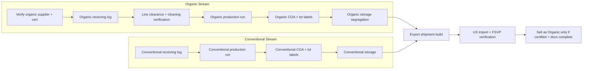

---

## Set B — Sequence diagrams (timelines of messages/actions) ⏱️

### B1) Ocean LCL shipment (FOB) — end-to-end

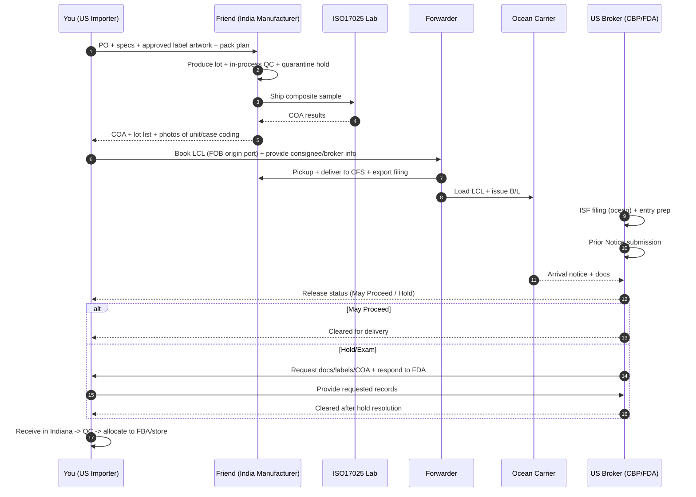

---

### B2) Air pilot shipment (small validation batch)

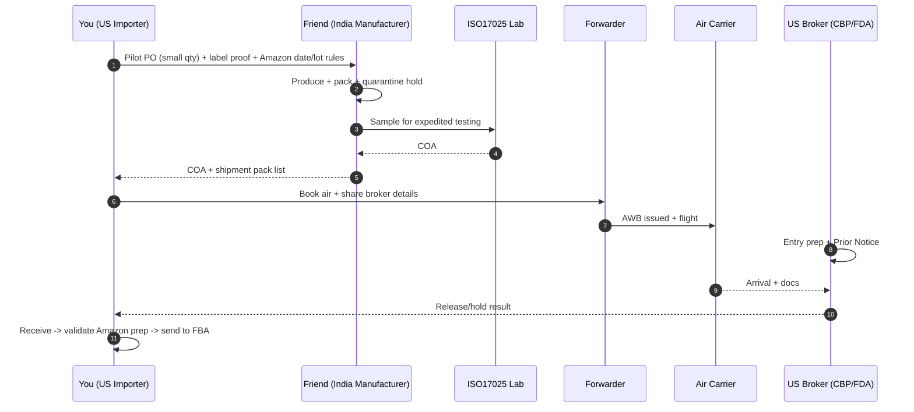

---

### B3) Amazon FBA inbound (expirable + lot/best-by controls)

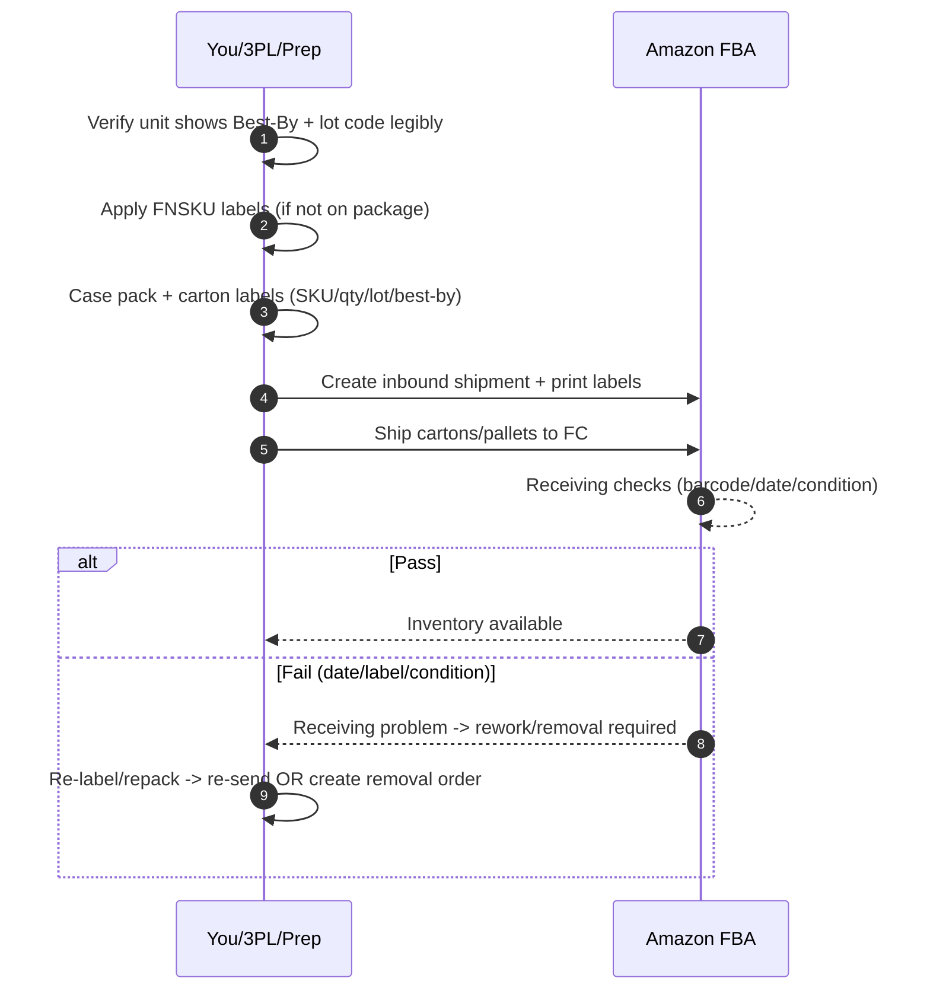

---

## Set C — State diagrams (inventory + compliance lifecycle) 🔁

### C1) Inventory status state machine (per lot)

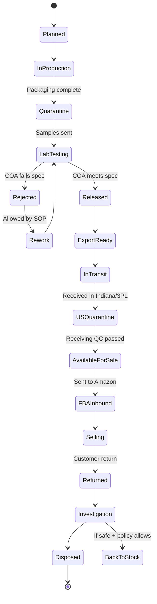

---

### C2) Compliance documentation lifecycle (what must exist before sale)

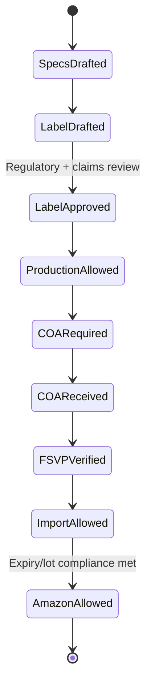

---

## Set D — Exception / Hold / Failure flowcharts 🚨

### D1) FDA hold resolution decision tree

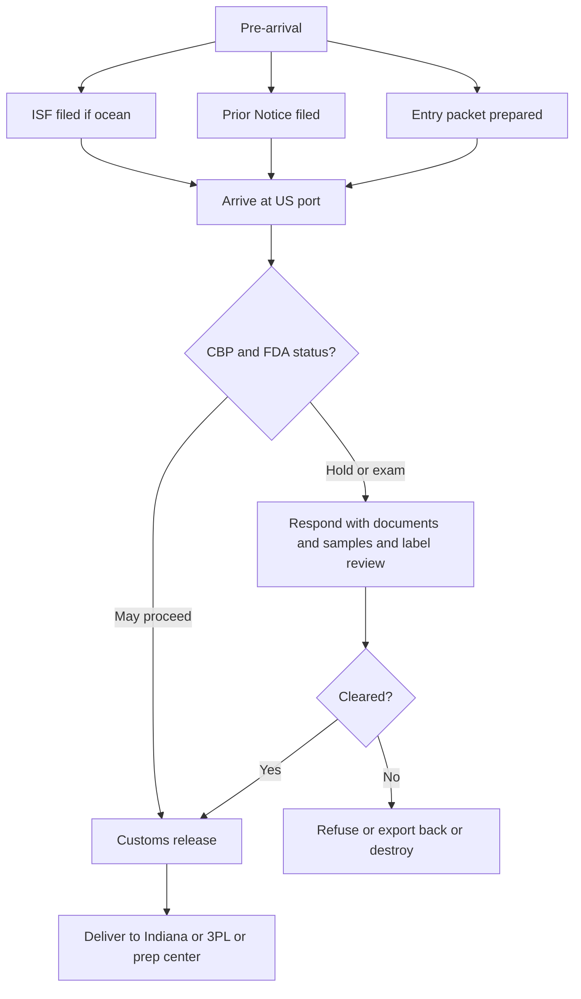

---

### D2) Quality deviation + CAPA flow (manufacturing-side)

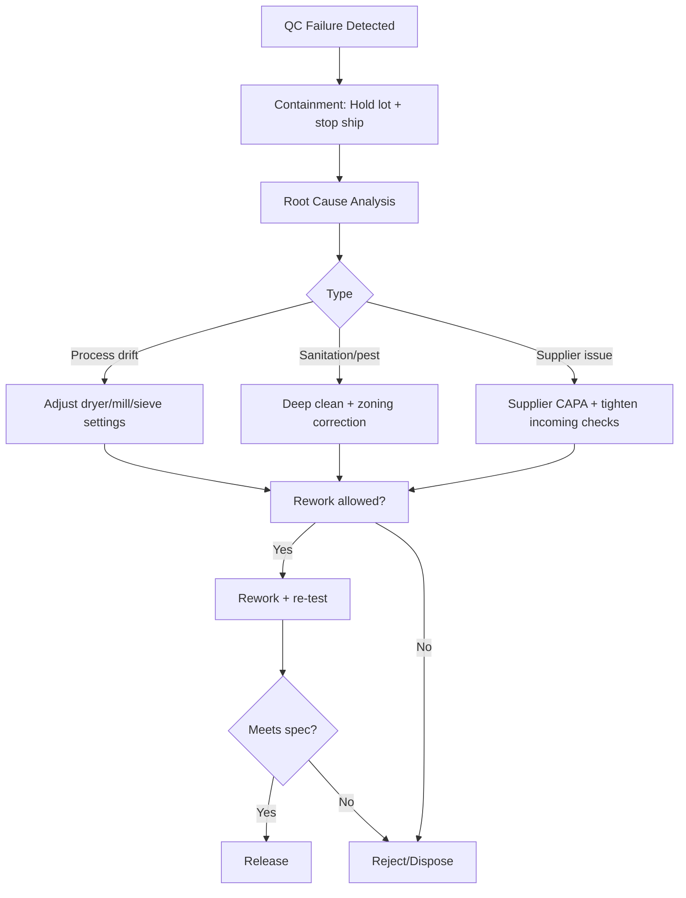

---

## Set E — Gantt timeline (month-by-month to first shipment + Amazon launch) 🗓️

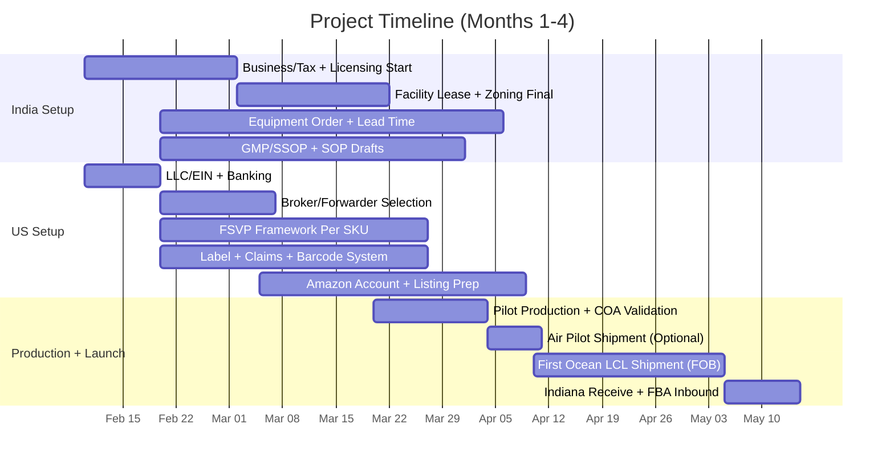

---

## Set F — “Scenario pack” flowcharts (A vs B) 🏪📦

### F1) Scenario A (Store + Amazon) with compliance branching

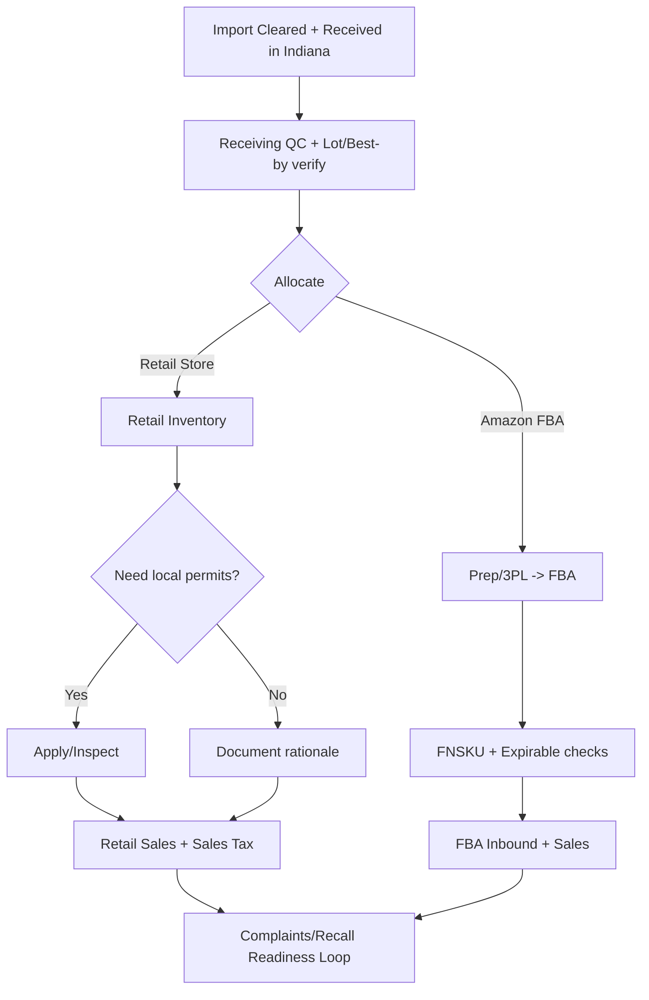

---

### F2) Scenario B (Amazon-only) with faster operational loop

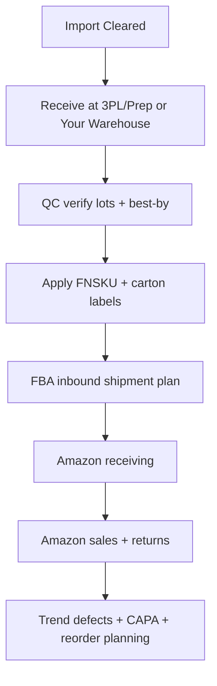

---

## Next (if you want even more) 🔧

I can add:

1. **ERD diagram** (tables/entities) for a compliance database (Lots, COAs, Shipments, Claims, Labels, Suppliers).
2. **Mind-map** diagrams for “Documentation Binder Structure.”
3. **Sub-process diagrams per SKU** (orange peel vs whole, lemon peel vs juice solids) including label impacts.

Say: **“Generate ERD + binder mind-maps”** and I’ll output those Mermaid blocks.
