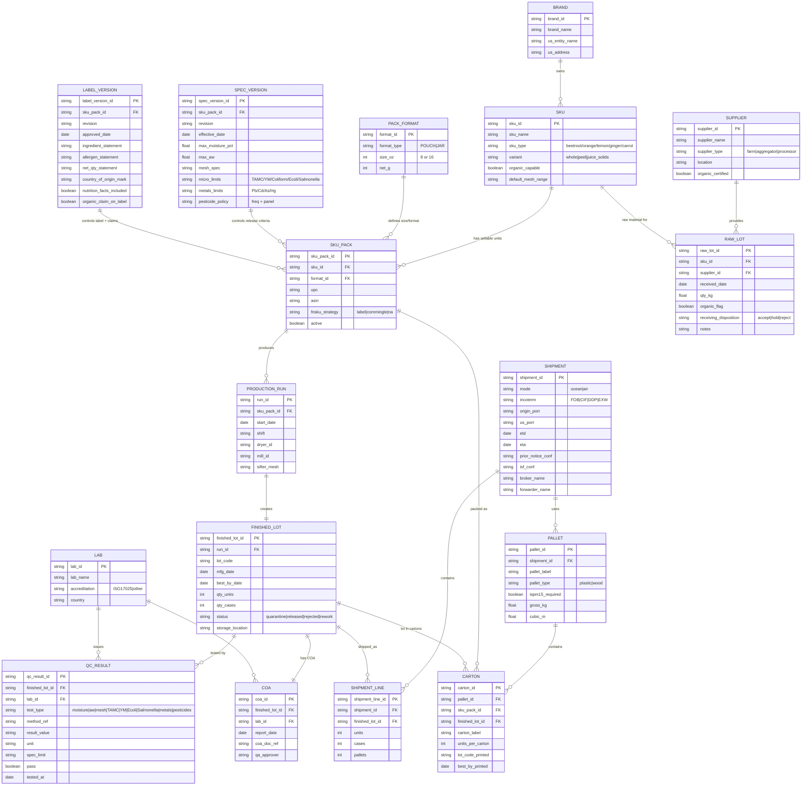
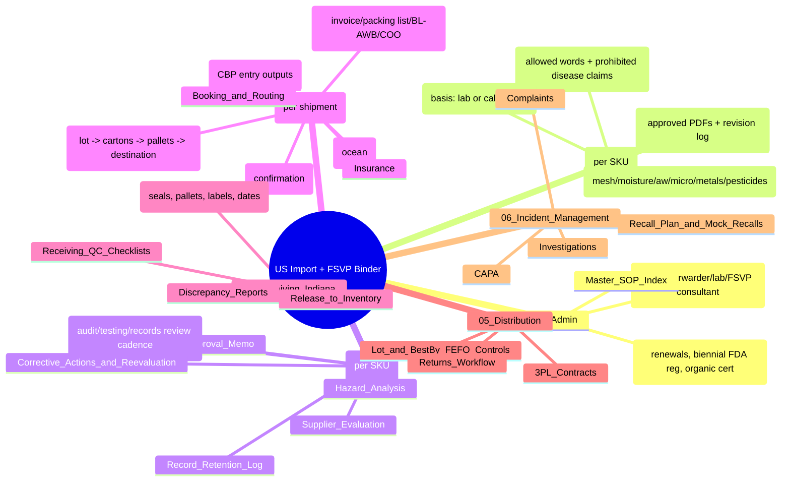
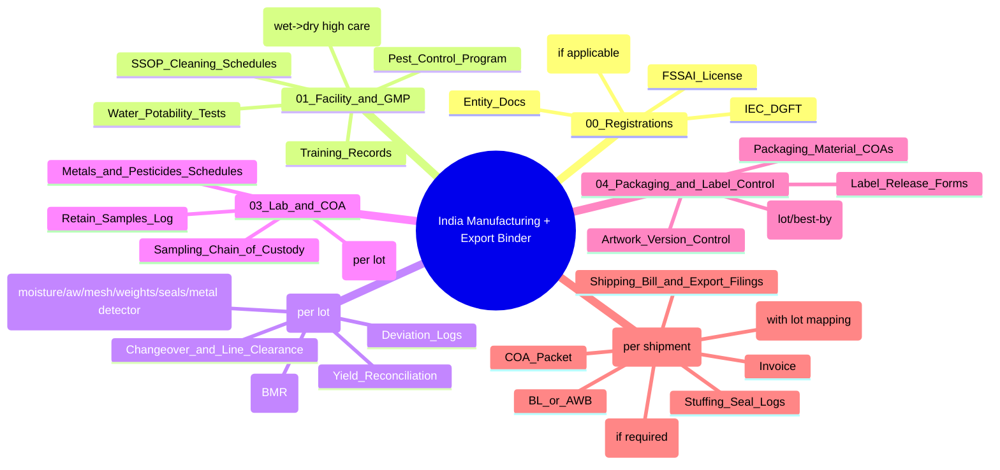
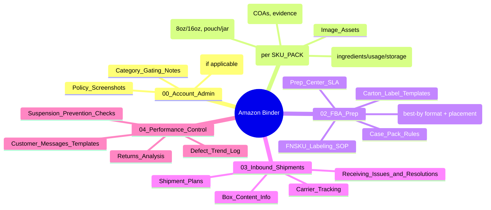
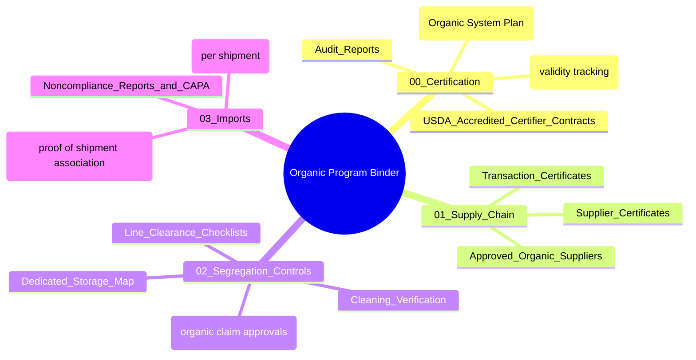
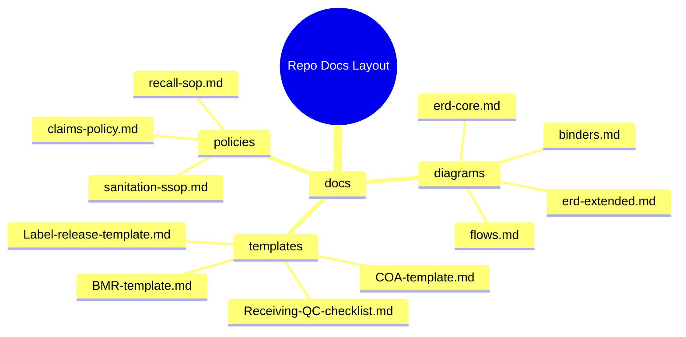

## ERD (Core Compliance Database) — paste into `docs/erd-core.md`

---

## ERD (Expanded: Claims, Complaints, CAPA, Recalls, Documents) — paste into `docs/erd-extended.md`

```mermaid
erDiagram
  FINISHED_LOT ||--o{ LOT_DOCUMENT : has
  SHIPMENT ||--o{ SHIPMENT_DOCUMENT : has
  SUPPLIER ||--o{ SUPPLIER_DOCUMENT : has
  DOCUMENT ||--o{ LOT_DOCUMENT : links
  DOCUMENT ||--o{ SHIPMENT_DOCUMENT : links
  DOCUMENT ||--o{ SUPPLIER_DOCUMENT : links

  LABEL_VERSION ||--o{ CLAIM_SET_ITEM : includes
  CLAIM ||--o{ CLAIM_SET_ITEM : member
  CLAIM ||--o{ CLAIM_EVIDENCE : proven_by
  DOCUMENT ||--o{ CLAIM_EVIDENCE : evidence_doc

  SKU_PACK ||--o{ COMPLAINT : receives
  FINISHED_LOT ||--o{ COMPLAINT : traced_to

  COMPLAINT ||--o{ CAPA : triggers
  AUDIT ||--o{ CAPA : triggers
  QC_RESULT ||--o{ CAPA : triggers

  RECALL ||--o{ RECALL_LOT : includes
  FINISHED_LOT ||--o{ RECALL_LOT : affected

  PROVIDER ||--o{ AUDIT : performs
  PROVIDER ||--o{ ORGANIC_CERT : issues
  ORGANIC_CERT ||--o{ SUPPLIER_DOCUMENT : supports

  DOCUMENT {
    string document_id PK
    string doc_type "invoice|packing_list|coa|pn|isf|organic_cert|audit|label_proof|insurance"
    string issuer
    date issue_date
    date valid_to
    string storage_uri
    string checksum
  }

  LOT_DOCUMENT {
    string lot_doc_id PK
    string finished_lot_id FK
    string document_id FK
    string notes
  }

  SHIPMENT_DOCUMENT {
    string ship_doc_id PK
    string shipment_id FK
    string document_id FK
    string notes
  }

  SUPPLIER_DOCUMENT {
    string supp_doc_id PK
    string supplier_id FK
    string document_id FK
    string notes
  }

  CLAIM {
    string claim_id PK
    string claim_type "organic|non_gmo|gluten_free|vegan|no_additives|other"
    string claim_text
    string risk_level "low|med|high"
  }

  CLAIM_SET_ITEM {
    string claim_set_item_id PK
    string label_version_id FK
    string claim_id FK
  }

  CLAIM_EVIDENCE {
    string evidence_id PK
    string claim_id FK
    string document_id FK
    date evidence_valid_to
    string notes
  }

  COMPLAINT {
    string complaint_id PK
    string sku_pack_id FK
    string finished_lot_id FK
    string channel "amazon|store|other"
    date complaint_date
    string severity "low|med|high"
    string description
    string outcome
  }

  CAPA {
    string capa_id PK
    string source_type "complaint|audit|qc"
    string source_ref_id
    date opened_date
    string root_cause
    string corrective_action
    string preventive_action
    date due_date
    string status "open|in_progress|closed"
  }

  AUDIT {
    string audit_id PK
    string provider_id FK
    date audit_date
    string audit_type "internal|supplier|organic|customer"
    string findings_summary
    string report_document_id
  }

  RECALL {
    string recall_id PK
    date start_date
    string trigger "complaint|audit|lab|regulatory"
    string scope_definition
    string status "draft|active|closed"
  }

  RECALL_LOT {
    string recall_lot_id PK
    string recall_id FK
    string finished_lot_id FK
    string disposition "hold|remove|destroy|return"
  }

  PROVIDER {
    string provider_id PK
    string provider_type "lab|broker|forwarder|us_agent|certifier|3pl|printer"
    string provider_name
    string country
  }

  ORGANIC_CERT {
    string organic_cert_id PK
    string provider_id FK
    string certificate_no
    date valid_from
    date valid_to
    string scope
    string document_id
  }
```

---

# Binder Mind-Maps (folder structures) — paste into `docs/binders.md`

## Mind-map 1 — **US Import + FSVP Binder (per SKU + per shipment)** 🇺🇸

---

## Mind-map 2 — **India Manufacturing + Export Binder (GMP + lots + exports)** 🇮🇳

---

## Mind-map 3 — **Amazon Binder (FBA prep + expirable + listing compliance)** 📦

---

## Mind-map 4 — **Organic Program Binder (only if selling “USDA Organic”)** 🌿

---

## Optional: “Repo layout suggestion” mindmap (drop-in)

If you want, I can also generate:

* a **“FSVP binder per SKU” mindmap template** you can reuse for all 10 SKUs
* an **ERD variant specifically for carton/pallet optimization + landed cost tracking**
