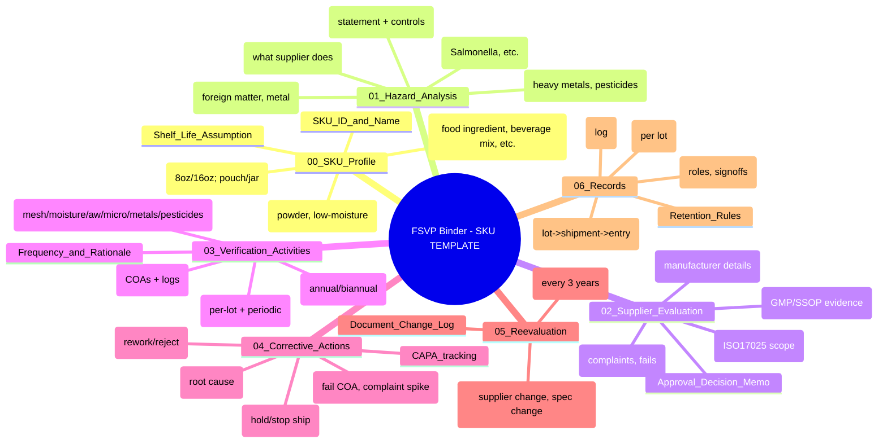
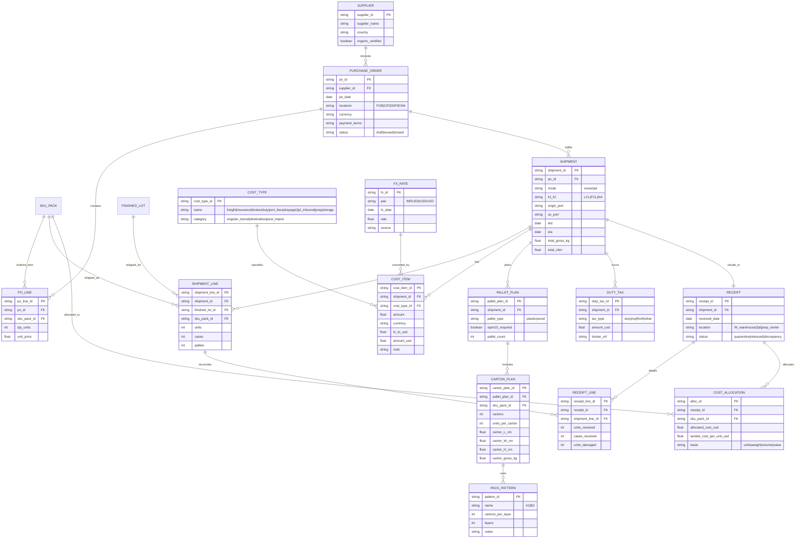
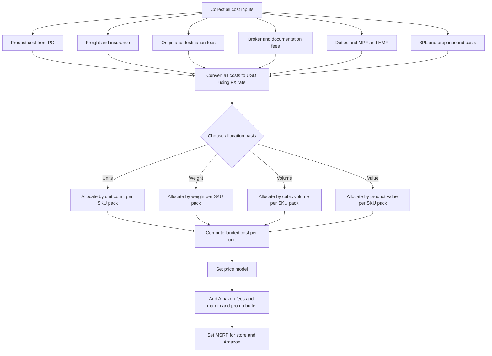
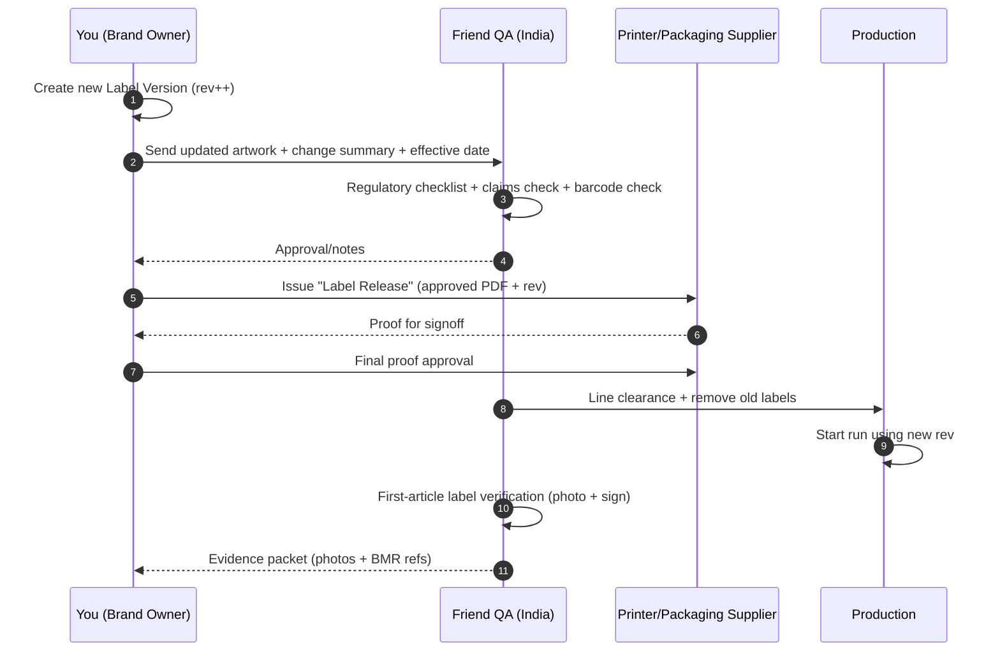
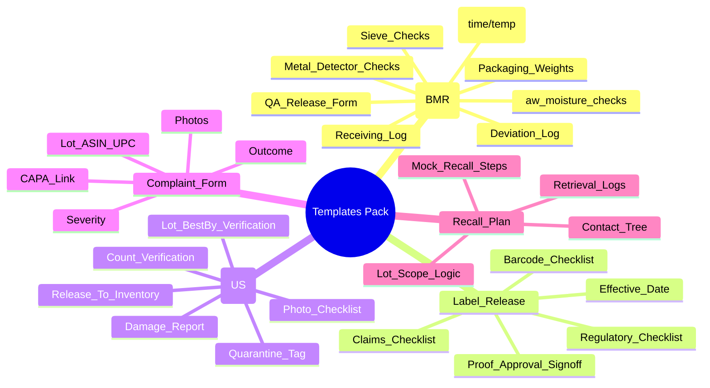

## 1) Mind-map template — **FSVP Binder per SKU (repeat for all 10 SKUs)** 🧾

Paste into `docs/fsqp-fsvp-per-sku-template.md`:



---

## 2) ERD — **Carton/Pallet optimization + Landed Cost tracking** 💰📦

Paste into `docs/erd-landed-cost.md`:



---

## 3) Flowchart — **Landed cost calculation (clean, auditable)** 🧮

Paste into `docs/flows-landed-cost.md`:



---

## 4) Flowchart — **Cartonization + Palletization planner (pouch vs jar)** 📦

Paste into `docs/flows-cartonization.md`:

```mermaid
flowchart TD
  A[Choose SKU_PACK] --> B{Format}
  B -->|Pouch| P1[Select pouch case pack]
  B -->|Jar| J1[Select jar case pack]

  P1 --> P2[Target: stable cube + low crush risk]
  J1 --> J2[Target: breakage control + dividers]

  P2 --> C[Compute carton dims + gross kg]
  J2 --> C

  C --> D{Meets carrier limits?}
  D -->|Yes| E[Select pallet type (plastic preferred)]
  D -->|No| F[Adjust units per carton / carton spec]
  F --> C

  E --> G[Pick pattern: cartons per layer + layers]
  G --> H[Compute pallet height + gross kg + CBM]
  H --> I{Within safe handling?}
  I -->|Yes| J[Lock carton label + pallet label templates]
  I -->|No| K[Reduce layers / change carton]
  K --> G
```

---

## 5) Sequence diagram — **Label change management (prevent “wrong label” disasters)** 🏷️

Paste into `docs/seq-label-change.md`:



---

## 6) Mind-map — **Templates pack (what to store in repo for audit readiness)** 📁

Paste into `docs/templates-mindmap.md`:



---

If you want the next “continue” set, I can generate:

* **ERD for Amazon performance + returns + review mining** (ASIN → defects → CAPA)
* **Mind-map for a “Single Master Compliance Dashboard”** (KPIs: COA pass rate, holds, defect rate, FEFO accuracy)
