GitHub can render Mermaid diagrams directly in Markdown when you wrap the diagram in a fenced code block labeled `mermaid`. ([GitHub Docs][1])
If you publish via **GitHub Pages (Jekyll)**, Mermaid may not render by default and you may see the raw code unless you add a Mermaid renderer step. ([GitHub Discussion][2])

Below are **paste-ready Mermaid charts** you can copy into `README.md` or any `.md` file in your repo.

> **Mermaid reliability rules (prevents parse errors):**
>
> * One arrow/statement per line
> * Keep node labels on a single line
> * Prefer quoted labels: `A["text"]`
> * Avoid special characters inside labels (use `m3` instead of `m³`, avoid `+` where possible)

---

## Chart 1 — End-to-end overview (Friend vs You) 🧭

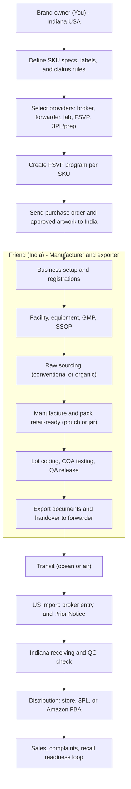

---

## Chart 2 — Manufacturing SOP (Beetroot master flow) 🏭

```mermaid
flowchart LR
  R1["Receiving"] --> R2["Wash"]
  R2 --> R3["Sort and trim"]
  R3 --> R4["Slice 3 to 6 mm"]
  R4 --> D1{"Blanch?"}

  D1 -->|Yes| B1["Blanch or steam"]
  D1 -->|No| DY["Dry"]

  B1 --> DY
  DY --> M1["Mill or grind"]
  M1 --> S1["Sieve (mesh spec)"]
  S1 --> F1["Magnet(s)"]
  F1 --> MD["Metal detector"]

  MD --> P0{"Pack format?"}

  P0 -->|Pouch| P1["Fill pouch"]
  P1 --> P1A["Optional nitrogen flush"]
  P1A --> P1B["Seal pouch"]

  P0 -->|Jar| P2["Fill jar"]
  P2 --> P2A["Cap jar"]
  P2A --> P2B["Optional induction seal"]

  P1B --> C1["Print lot and best-by"]
  P2B --> C1

  C1 --> CP["Case pack"]
  CP --> PL["Palletize and stage"]
  PL --> QH["QA hold pending COA"]
```

---

## Chart 3 — SKU process differences (decision logic) 🍋🍊

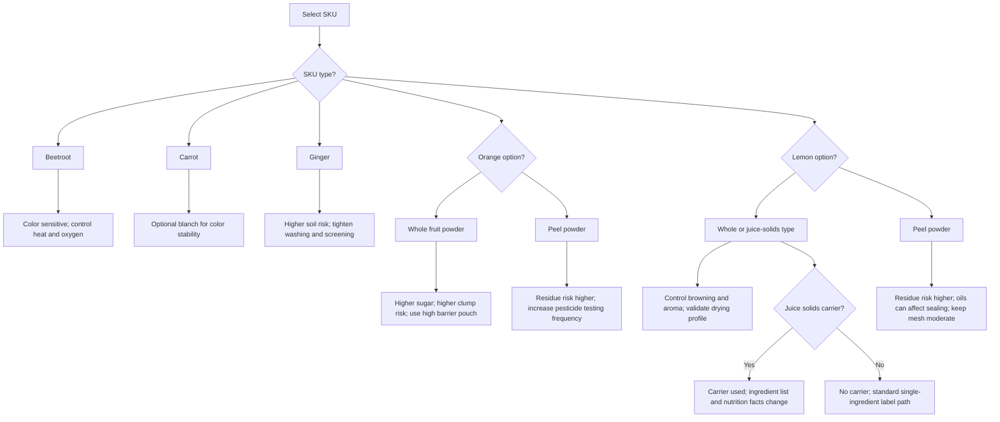

---

## Chart 4 — Quality system (GMP, SSOP, Pest, Traceability) 🧼

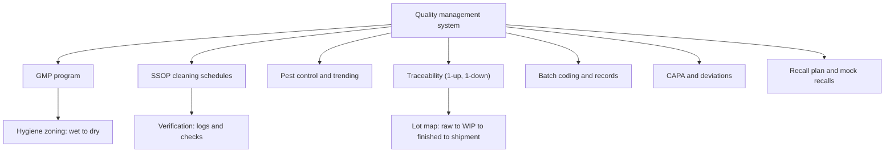

---

## Chart 5 — COA and Release workflow (per lot) 🧪

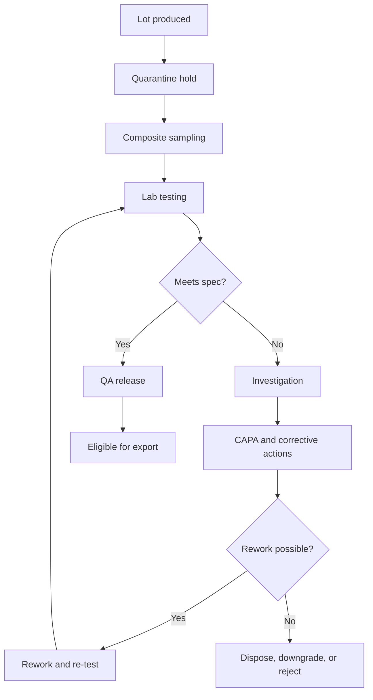

---

## Chart 6 — Organic vs Conventional segregation controls 🌿

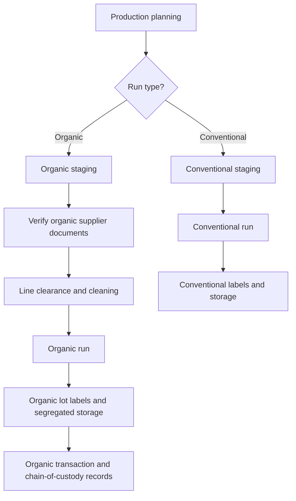

---

## Chart 7 — Export docs package (India) 📄

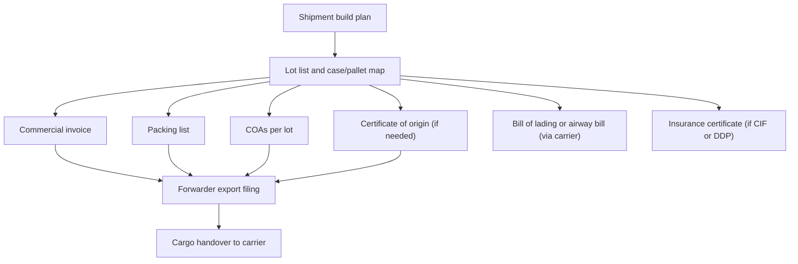

---

## Chart 8 — US import flow (Broker + Prior Notice) 🇺🇸

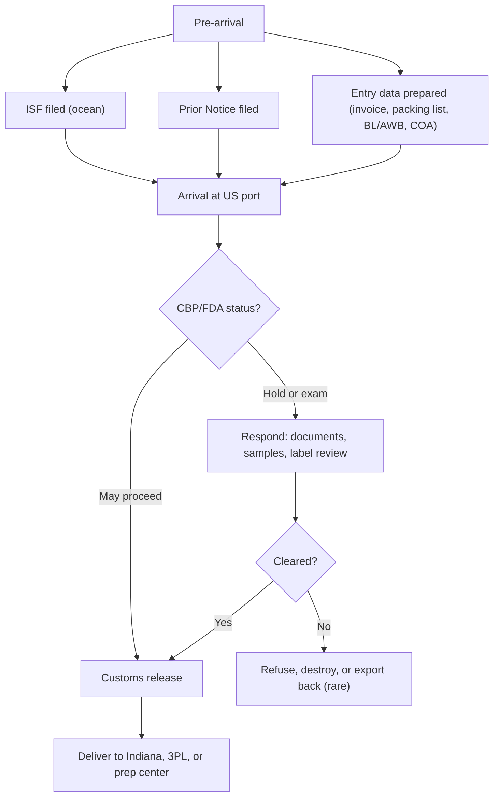

---

## Chart 9 — Shipping method decision (Air vs Sea; LCL vs FCL) 🚢✈️

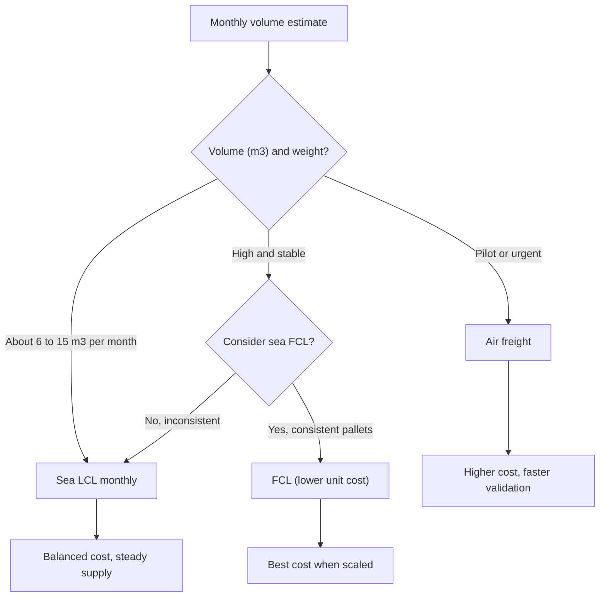

---

## Chart 10 — Incoterms selection (beginner-safe) 📦

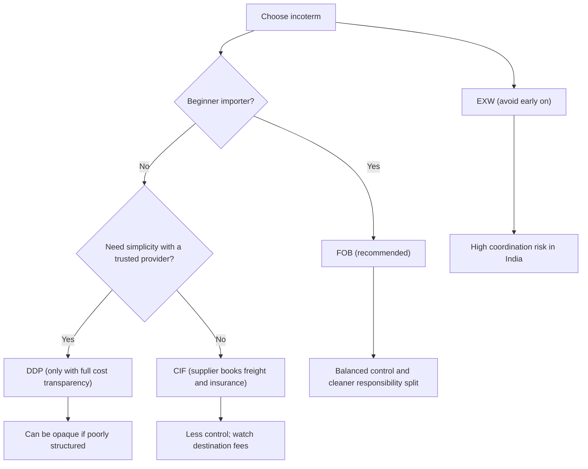

---

## Chart 11 — Distribution Scenario A (Store + Amazon) 🏪📦

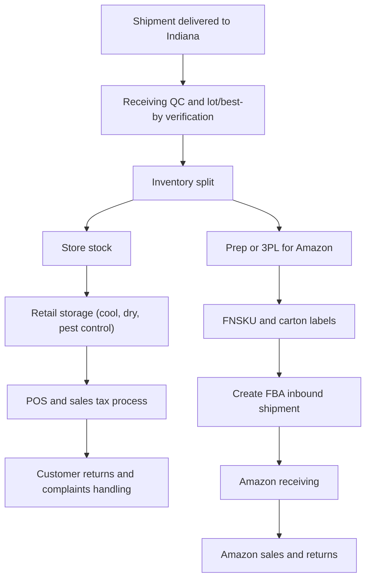

---

## Chart 12 — Distribution Scenario B (Amazon-only) 📦

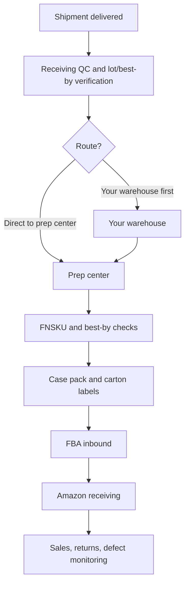

---

## Chart 13 — Amazon FBA expirable prep workflow 🏷️

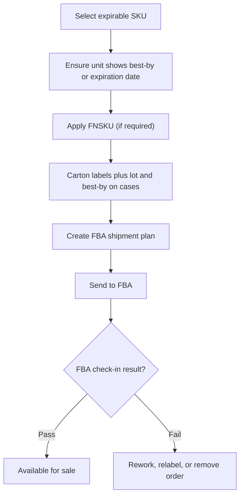

---

## Chart 14 — Traceability + complaint to recall loop 🔁

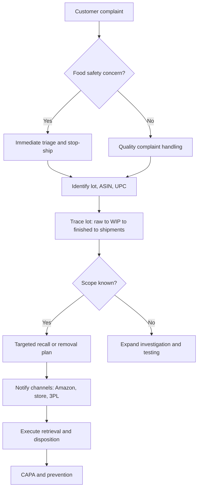

---

## Chart 15 — Scale from 5 SKUs to 10 SKUs (no redesign) 📈

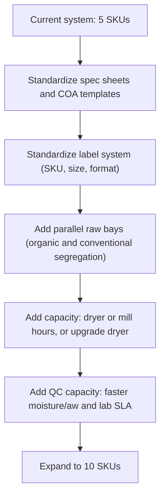

---

# Minimal usage in your GitHub repo 🧩

1. Paste any block into `README.md` or `docs/diagrams.md`:

````text
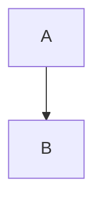
````

2. GitHub renders Mermaid on GitHub.com automatically. ([GitHub Docs][1])
3. If GitHub Pages shows raw Mermaid, you need extra setup. ([GitHub Discussion][2])

If you want more charts next, I can add:

* Swimlane diagrams (Friend vs Forwarder vs Broker vs You vs Amazon)
* Sequence diagrams (Ocean LCL shipment, Air pilot shipment)
* State diagrams (Inventory lifecycle: quarantine → released → in transit → FBA → sold/returned)

[1]: https://docs.github.com/en/get-started/writing-on-github/working-with-advanced-formatting/creating-diagrams "Creating Mermaid diagrams"
[2]: https://github.com/orgs/community/discussions/65040 "Mermaid diagrams not showing in GitHub Pages discussion"
