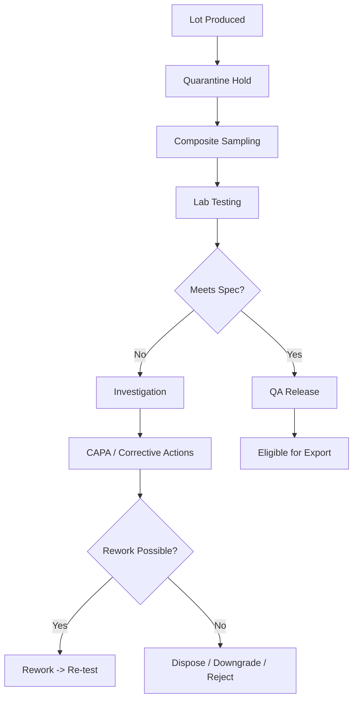
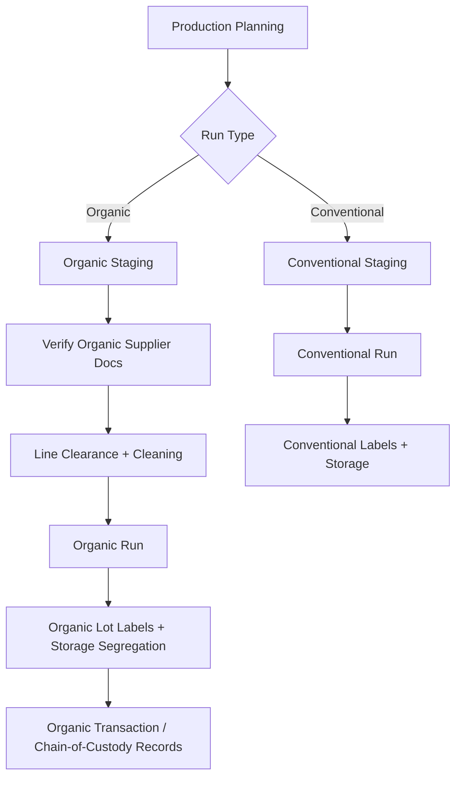
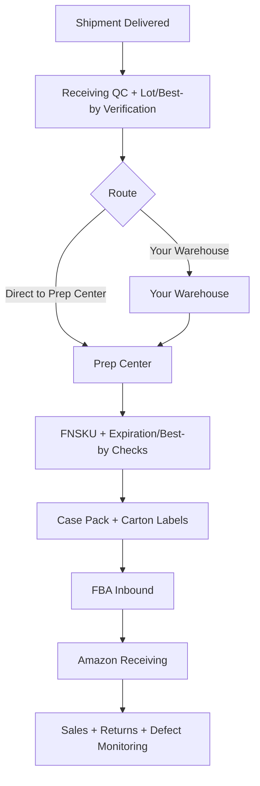

GitHub renders Mermaid diagrams directly inside Markdown when you use a fenced block labeled `mermaid`. ([GitHub Docs][1])
Note: GitHub Pages (Jekyll) may *not* render Mermaid by default; it can show raw code unless you add a renderer step. ([GitHub][2])

Below are **multiple paste-ready Mermaid charts** (copy/paste into `README.md` or any `.md` in your repo).

---

## Chart 1 — End-to-end overview (Friend vs You) 🧭

```mermaid
flowchart TD
  A[Brand Owner (You) - Indiana, USA] --> B[Define SKU Specs + Labels + Claims Policy]
  B --> C[Select Providers: Broker, Forwarder, Lab, FSVP Consultant, 3PL/Prep]
  C --> D[FSVP Program Created per SKU]
  D --> E[Purchase Order + Artwork Release to India]

  subgraph INDIA[Friend (India) - Manufacturer/Exporter]
    I1[Business + Food License + Export IDs] --> I2[Facility + Equipment + GMP/SSOP]
    I2 --> I3[Raw Material Sourcing (Conventional/Organic)]
    I3 --> I4[Manufacture + Pack Retail-Ready (Pouch/Jar)]
    I4 --> I5[Lot Coding + COA Testing + QA Release]
    I5 --> I6[Export Docs + Handover to Forwarder]
  end

  E --> I1
  I6 --> U1[Ocean/Air Transit]
  U1 --> U2[US Import: Broker Entry + Prior Notice]
  U2 --> U3[Indiana Receiving + QC Check]
  U3 --> U4[Distribution: Store / 3PL / Amazon FBA]
  U4 --> U5[Sales + Complaints + Recall Readiness Loop]
```

---

## Chart 2 — Manufacturing SOP (Beetroot master flow) 🏭

```mermaid
flowchart LR
  R1[Receiving] --> R2[Wash]
  R2 --> R3[Sort/Trim]
  R3 --> R4[Slice 3-6mm]
  R4 --> D1{Blanch?}
  D1 -- Yes --> B1[Blanch/Steam]
  D1 -- No --> DY[Dry]
  B1 --> DY[Dry]
  DY --> M1[Mill/Grind]
  M1 --> S1[Sieve (Mesh Spec)]
  S1 --> F1[Magnet(s)]
  F1 --> MD[Metal Detector]
  MD --> P0{Pack Format}
  P0 -- Pouch --> P1[Fill -> (Optional N2) -> Seal]
  P0 -- Jar --> P2[Fill -> Cap -> (Optional Induction Seal)]
  P1 --> C1[Lot/Best-by Coding]
  P2 --> C1
  C1 --> CP[Case Pack]
  CP --> PL[Palletize/Stage]
  PL --> QH[QA Hold Pending COA]
```

---

## Chart 3 — SKU process differences (decision logic) 🍋🍊

```mermaid
flowchart TD
  A[Select SKU] --> B{SKU Type}
  B -->|Beetroot| BR[Fast dry; color-sensitive; manage dust heat]
  B -->|Carrot| CR[Often blanch helps color stability]
  B -->|Ginger| GI[Strong soil/stone risk; tighten screening + washing]
  B -->|Orange| OR{Whole vs Peel}
  B -->|Lemon| LE{Whole/Juice-solids vs Peel}

  OR -->|Whole| ORW[Higher sugar; clumping risk; lower temp + better barrier]
  OR -->|Peel| ORP[Residue risk; pesticides testing higher frequency]

  LE -->|Peel| LEP[Residue risk high; oil aroma; mesh may be coarser]
  LE -->|Whole| LEW[Acidic; aroma; control browning]
  LE -->|Juice Solids| LES[Often needs carrier (label changes + specs)]
```

---

## Chart 4 — Quality system (GMP/SSOP/Pest/Traceability) 🧼

```mermaid
flowchart TD
  Q0[Quality Management System] --> Q1[GMP Program]
  Q0 --> Q2[SSOP Cleaning Schedules]
  Q0 --> Q3[Pest Control + Trending]
  Q0 --> Q4[Traceability (1-up/1-down)]
  Q0 --> Q5[Batch Coding + Records]
  Q0 --> Q6[CAPA + Deviations]
  Q0 --> Q7[Recall Program + Mock Recalls]

  Q1 --> Z1[Zoning: Wet -> Dry High-Care]
  Q2 --> V1[Verification: Visual + Logs (+ Optional ATP)]
  Q4 --> L1[Lot Map: Raw -> WIP -> Finished -> Shipment]
```

---

## Chart 5 — COA + Release workflow (per lot) 🧪



---

## Chart 6 — Organic vs Conventional segregation controls 🌿



---

## Chart 7 — Export docs package (India) 📄

```mermaid
flowchart TD
  A[Shipment Build Plan] --> B[Lot List + Case/Pallet Map]
  B --> C[Commercial Invoice]
  B --> D[Packing List]
  B --> E[COAs per Lot]
  B --> F[Certificate of Origin (if needed)]
  B --> G[Bill of Lading / Airway Bill (via Carrier)]
  B --> H[Insurance Cert (if CIF/DDP)]
  C --> Z[Forwarder Export Filing]
  D --> Z
  E --> Z
  F --> Z
  Z --> Y[Cargo Handover to Carrier]
```

---

## Chart 8 — US import flow (Broker + Prior Notice) 🇺🇸

```mermaid
flowchart TD
  A[Pre-Arrival] --> B[ISF Filed (Ocean)]
  A --> C[Prior Notice Filed]
  A --> D[Entry Data Prepared (Invoice/PL/BL/COA)]
  B --> E[Arrival US Port]
  C --> E
  D --> E
  E --> F{CBP/FDA Status}
  F -->|May Proceed| G[Customs Release]
  F -->|Hold/Exam| H[Respond: Docs/Samples/Label Review]
  H --> I{Cleared?}
  I -->|Yes| G
  I -->|No| J[Refuse/Destroy/Export Back (rare)]
  G --> K[Deliver to Indiana / 3PL / Prep Center]
```

---

## Chart 9 — Shipping method decision (Air vs Sea; LCL vs FCL) 🚢✈️

```mermaid
flowchart TD
  A[Monthly Volume Estimate] --> B{Volume (m³) + Weight}
  B -->|Small pilot / urgent| AIR[Air Freight]
  B -->|~6-15 m³/month| LCL[Sea LCL Monthly]
  B -->|High & stable volume| FCL{Sea FCL?}

  FCL -->|Yes, consistent pallets| FCLY[FCL (Lower unit cost)]
  FCL -->|No, inconsistent| LCL

  AIR --> P1[Higher cost, fast validation]
  LCL --> P2[Balanced cost, steady supply]
  FCLY --> P3[Best cost when scaled]
```

---

## Chart 10 — Incoterms selection (beginner-safe) 📦

```mermaid
flowchart TD
  A[Choose Incoterm] --> B{Beginner?}
  B -->|Yes| FOB[FOB (Recommended)]
  B -->|No| C{Need simplicity + trusted provider?}
  C -->|Yes| DDP[DDP (Only with strong transparency)]
  C -->|No| CIF[CIF (Supplier books freight/insurance)]

  A --> EXW[EXW (Avoid early on)]
  EXW --> R1[High coordination risk in India]
  FOB --> R2[Balanced control + cleaner responsibility split]
  CIF --> R3[Less control; watch destination fees]
  DDP --> R4[Opaque costs if poorly structured]
```

---

## Chart 11 — Distribution Scenario A (Store + Amazon) 🏪 + 📦

```mermaid
flowchart TD
  A[Shipment Delivered to Indiana] --> B[Receiving QC + Lot/Best-by Verification]
  B --> C[Inventory Split]
  C --> S[Store Stock]
  C --> P[Prep/3PL for Amazon]

  S --> S1[Retail Storage (cool/dry/pest control)]
  S1 --> S2[POS + Sales Tax Process]
  S2 --> S3[Customer Returns/Complaints Handling]

  P --> P1[FNSKU + Carton Labels]
  P1 --> P2[FBA Inbound Shipment Creation]
  P2 --> P3[Amazon Receiving]
  P3 --> P4[Amazon Sales + Returns]
```

---

## Chart 12 — Distribution Scenario B (Amazon-only) 📦



---

## Chart 13 — Amazon FBA “expirable” prep workflow 🏷️

```mermaid
flowchart TD
  A[Select Expirable SKU] --> B[Ensure Unit Shows Best-by/Exp Date]
  B --> C[Apply FNSKU (if required)]
  C --> D[Carton Labels + Lot/Best-by on Cases]
  D --> E[Create FBA Shipment Plan]
  E --> F[Send to FBA]
  F --> G{FBA Check-in}
  G -->|Pass| H[Available for Sale]
  G -->|Fail| I[Rework / Relabel / Remove Order]
```

---

## Chart 14 — Traceability + complaint → recall loop 🔁

```mermaid
flowchart TD
  A[Customer Complaint] --> B{Food Safety Concern?}
  B -->|Yes| C[Immediate Triage + Stop-Ship]
  B -->|No| D[Quality Complaint Handling]

  C --> E[Identify Lot/ASIN/UPC]
  D --> E
  E --> F[Trace Lot: Raw -> WIP -> Finished -> Shipments]
  F --> G{Scope Known?}
  G -->|Yes| H[Targeted Recall/Removal Plan]
  G -->|No| I[Expand Investigation + Testing]

  H --> J[Notify Channels (Amazon/Store/3PL)]
  J --> K[Execute Retrieval + Disposition]
  K --> L[CAPA + Prevent Recurrence]
```

---

## Chart 15 — Scale from 5 SKUs → 10 SKUs (no redesign) 📈

```mermaid
flowchart TD
  A[Current System: 5 SKUs] --> B[Standardize Spec Sheets + COA Templates]
  B --> C[Standardize Label System (SKU/Size/Format)]
  C --> D[Add Parallel Raw Bays (Org/Conv Segregation)]
  D --> E[Add Capacity: Dryer/Mill Hours or Upgrade Dryer]
  E --> F[Add QC Capacity: Faster aw/moisture + Lab SLA]
  F --> G[Expand to 10 SKUs]
```

---

# How to use these in your GitHub repo (minimal) 🧩

1. Paste any block into `README.md` or `docs/diagrams.md` like:

   ````
   ```mermaid
   flowchart TD
     A --> B
   ```
   ````
2. GitHub renders it automatically in Markdown files on GitHub.com. ([GitHub Docs][1])
3. If you use **GitHub Pages** and diagrams show as code, you’ll need extra setup (Pages may not render Mermaid by default). ([GitHub][2])

---

If you want “even more charts,” the next set I can generate are:

* **Swimlane flowcharts** (Friend vs Forwarder vs Broker vs You vs Amazon)
* **Sequence diagrams** for “Ocean LCL shipment” and “Air pilot shipment”
* **State diagram** for inventory status (Quarantine → Released → In-transit → FBA → Sold/Returned)

[1]: https://docs.github.com/en/get-started/writing-on-github/working-with-advanced-formatting/creating-diagrams?utm_source=chatgpt.com "Creating Mermaid diagrams"
[2]: https://github.com/orgs/community/discussions/65040?utm_source=chatgpt.com "Mermaid diagrams no showing in Github Pages #65040"
